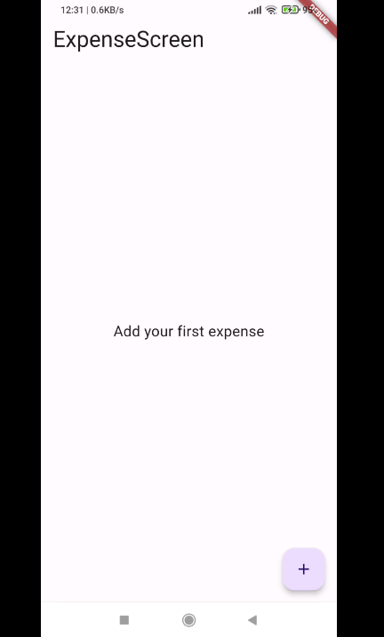

# expense_tracker_app

An expense tracker app that should connect with shared preferences and sqlite to track and calculate expenses.

### Features

- add and remove expenses
- have data stored locally via sqlite

    

### Technologies Used

    Flutter
    provider: ^6.1.2
    sqflite: ^2.3.3+1
    path: ^1.9.0

### Setup Instructions

    Clone the repository: git clone https://github.com/swapnil-up/expense_tracker_app.git
    Install dependencies: flutter pub get
    Run the app: flutter run

### App Demo GIF:

### License
This project is licensed under the [MIT License](LICENSE) - see the LICENSE file for details.